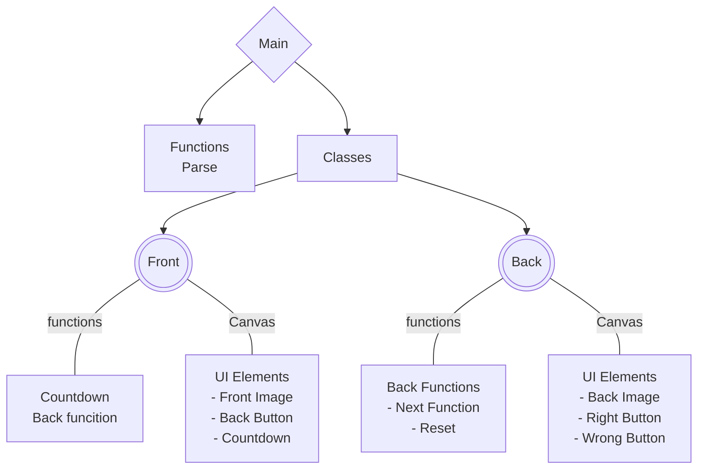

```mermaid
    flowchart TB
    %%UI
    Main{Main}
    Front(((Front)))
    Back(((Back)))

    Count[Countdown]
    B[Back Functions <br>- Next Function <br> - Reset]
    Main--> Fucntions[Functions <br>Parse ]
    Classes--> Front
    Main-->Classes--> Back
    Front -- functions --- Count[Countdown <br> Back funcition]
    Front -- Canvas --- Elements[UI Elements <br>- Front Image <br> - Back Button <br>- Countdown]

    Back -- functions --- B
    Back -- Canvas --- BackElements[UI Elements <br>- Back Image <br> - Right Button <br>- Wrong Button ]
```
